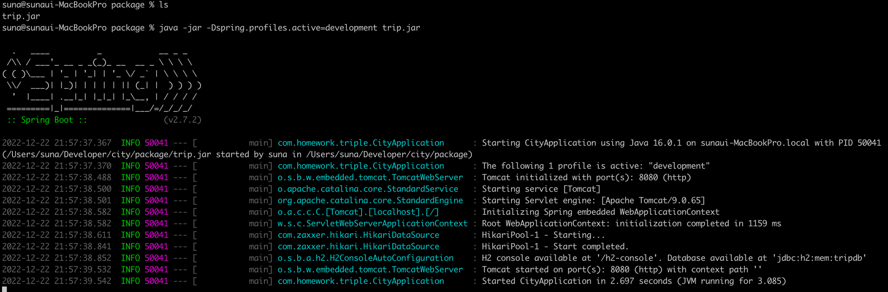
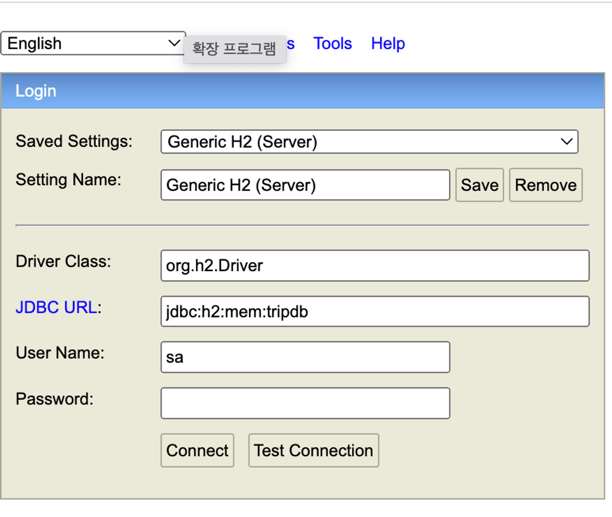

# City Rest Api server

여행지 (도시)를 관리하는 REST API 서버입니다.

## API
자세한 api 명세는 postman을 참고해주세요.   
[포스트맨](https://www.postman.com/restless-sunset-427704/workspace/city)


## 로컬 실행방법
### 테스트 환경 실행방법

**1. package 위치로 이동합니다.**

- trip.jar파일이 있는 위치입니다.

**2. 아래의 명령어를 입력하여 trip.jar파일을 실행합니다.**

- Dspring.profiles.active옵션에 development값을 주어, 테스트 환경으로 실행합니다.
- Spring이 뜰때, 더미데이터가 생성되도록 설정하였습니다.

```bash
java -jar -Dspring.profiles.active=development trip.jar
```

**3. [http://localhost:8080/h2-console](http://localhost:8080/h2-console) 에 접속하시면, 더미데이터를 확인하실 수 있습니다.**

아래의 사진을 참고하셔서, h2 console에 접속해주세요.


## production 환경 실행방법
### 1. mysql 실행
**1-1. 도커를 사용하여 mysql 이미지를 받아온다.**
```bash
docker pull mysql
```
**1-2. 도커 컨테이너 생성 및 실행**
* docker-compose.yml 파일이 위치한 디렉토리에서 실행해주세요.
```bash
docker-compose -p trip up -d
```

**1-3. 도커 컨테이너 목록 명령어로 컨테이너 이름 확인하기**

```
docker-compose ps
```

**1-4. 컨테이너 실행**

```bash
docker exec -it trip-db-1 bash
```

**1-5. mysql 실행**
- 비밀번호는 docker-compose.yml 정의해둔것처럼 r1234! 입니다.
```bash
mysql -u root -p
```

### 2. springboot 실행하기
**2-1. package 위치로 이동합니다.**

- trip.jar파일이 있는 위치입니다.

**2-2. 아래의 명령어를 입력하여 trip.jar파일을 실행합니다.**

- Dspring.profiles.active옵션에 production값을 주어, production 환경으로 실행합니다.

```bash
java -jar -Dspring.profiles.active=production ./trip.jar
```
